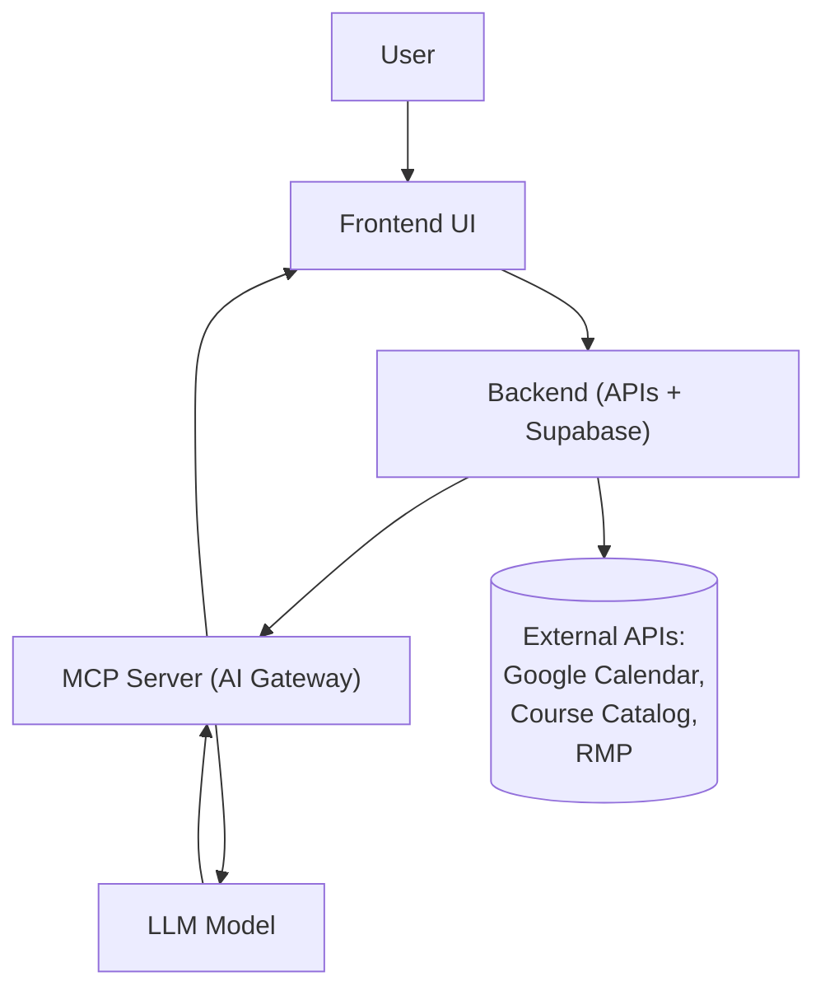

# Example Next.js MCP Server

**Uses `mcp-handler`**

## Usage

This sample app uses the [Vercel MCP Adapter](https://www.npmjs.com/package/mcp-handler) that allows you to drop in an MCP server on a group of routes in any Next.js project.

Update `app/[transport]/route.ts` with your tools, prompts, and resources following the [MCP TypeScript SDK documentation](https://github.com/modelcontextprotocol/typescript-sdk/tree/main?tab=readme-ov-file#server).

## Notes for running on Vercel

- To use the SSE transport, requires a Redis attached to the project under `process.env.REDIS_URL` and toggling the `disableSse` flag to `false` in `app/mcp/route.ts`
- Make sure you have [Fluid compute](https://vercel.com/docs/functions/fluid-compute) enabled for efficient execution
- After enabling Fluid compute, open `app/route.ts` and adjust `maxDuration` to 800 if you using a Vercel Pro or Enterprise account
- [Deploy the Next.js MCP template](https://vercel.com/templates/next.js/model-context-protocol-mcp-with-next-js)

## Sample Client

`script/test-client.mjs` contains a sample client to try invocations.

```sh
node scripts/test-client.mjs https://mcp-for-next-js.vercel.app
```

-------


🧠 High-Level Tech Stack Overview
1️⃣ 
Frontend (Student Experience Layer)
Framework: React (or React Native if mobile-first)


UI Components: Tailwind or Material UI


Purpose: Displays the integrated calendar, AI insights, and course advisor chat interface.


Key UX elements:


Unified Calendar View


“Ask AI” Chat Panel


Course Catalog & Planner Tab


Why this layer matters: It’s where students interact daily — all intelligence flows through this interface but remains user-driven and explainable.

2️⃣ 
Backend (Application + Integration Layer)
Core Backend: Node.js (Express or Fastify)


Database: Supabase (Postgres + Auth + Realtime)


APIs Integrated:


Google Calendar API (OAuth-based, read + write)


iCal feeds for Canvas/Outlook calendars


University Course Catalog API or web-scraper


Rate My Professor data (via scraper or cached dataset)


Purpose:
Aggregate all data sources into one normalized schema (CalendarEvents, Courses, Professors, etc.)


Provide clean API endpoints for the frontend and the AI MCP server to consume.


Why it matters: It’s the “hub” that keeps your AI logic separate from messy external integrations.

3️⃣ 
MCP Server (AI Intelligence Gateway)
Role: Acts as a middleware layer between the LLM and your structured data (catalog, calendars, course ratings).


Functionality:


Routes natural-language questions (“Which GE should I take?”) → structured queries to your backend.


Uses tools or plugins to call APIs and return structured JSON for the LLM.


Maintains context/session memory for follow-up questions.


Why it matters: It keeps your LLM stateless and compliant — the model never touches sensitive data directly, only sanitized results via MCP.
Think of it as:
“An airlock between the LLM brain and your student data warehouse.”

4️⃣ 
AI Layer (Reasoning + Summarization)
Model Options: OpenAI GPT-4o, Anthropic Claude, or Google Gemini.


Tasks:


Generate daily summaries (“Today you should focus on…”)


Answer catalog queries (“Find easy CS electives with Prof. X”)


Suggest study schedules (“You have free time at 2 PM—add a review block?”)


MCP + Tooling Integration:


The model gets structured data from the MCP server.


It can call tools like /getSchedule, /listCourses, /getProfessorReviews.


Why it matters: Keeps reasoning separate from data storage — scalable and secure.

5️⃣ 
Hosting & Infrastructure
Frontend: Vercel or Firebase Hosting (fast deploys + built-in SSL)


Backend & MCP Server: Fly.io or Render (lightweight containers)


Database: Supabase (managed Postgres)


Auth: Supabase Auth (Google Sign-In + BYU SSO later)


Analytics: PostHog or Supabase analytics


⚙️ Data Flow at a Glance
graph TD
  A[User] --> B[Frontend UI]
  B --> C[Backend (APIs + Supabase)]
  C --> D[MCP Server (AI Gateway)]
  D --> E[LLM Model]
  E --> D
  D --> B
  C --> F[(External APIs: Google Calendar, Course Catalog, RMP)]

🎯 Why This Architecture Works
Modular: AI and integrations can evolve independently.


Secure: Student data never leaves your backend.


Scalable: Each component (frontend, backend, MCP, AI) can scale separately.


Future-proof: Easy to plug in new data sources or AI models.




------
